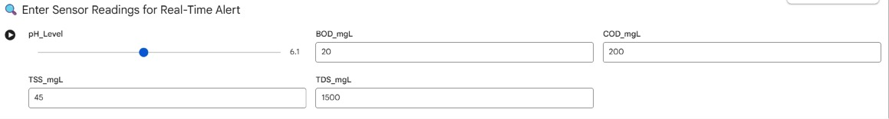
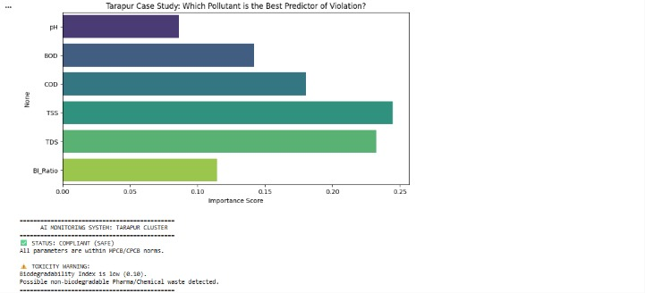

# AI-Based Industrial Effluent Monitoring System

## Overview

This project uses Machine Learning and environmental parameters to monitor industrial wastewater quality and detect pollution violations based on CPCB/MPCB standards.

## Features

- Random Forest Classification
- Real-time Effluent Safety Check
- Pollution Violation Detection
- Feature Importance Visualization
- Biodegradability Index (BOD/COD) Analysis
- Smart Alert System

## Technologies

- Python
- Pandas
- NumPy
- Matplotlib
- Seaborn
- Scikit-learn

## Parameters

- pH
- BOD
- COD
- TSS
- TDS

## Output

### Smart Alert System Output

### Compliance Report

- Safe/Critical Classification
- Toxicity Warning
- Regulatory Compliance Report
